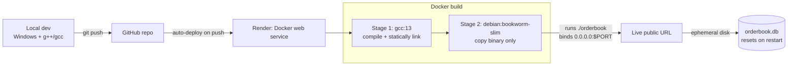

# Orderbook Engine

A limit order book and matching engine written in C++, with an HTTP API and SQLite-backed trade persistence. Built to explore how exchange-style matching systems are designed for correctness and low latency.

**Live demo:** https://orderbook-engine.onrender.com/orderbook
*(hosted on Render's free tier — the service sleeps after 15 minutes of inactivity, so the first request may take 30–60 seconds to wake it up)*

---

## Overview

The engine maintains a live limit order book, matches incoming orders against resting liquidity according to price-time priority, and persists every executed trade to a SQLite database. It's exposed over HTTP so orders can be placed, cancelled, and queried from outside the process.

Core matching rule: a trade executes whenever an incoming buy price is greater than or equal to the best resting sell price (or vice versa), and it always fills at the **resting order's price** — not the incoming order's price. At a given price level, orders are matched strictly in the order they arrived (FIFO / time priority).

## Architecture

**Request flow**

```mermaid
graph TD
    Client[Client / curl / browser] -->|HTTP request| Server[cpp-httplib server]

    Server -->|POST /order| AddOrder[addOrder]
    Server -->|POST /cancel| CancelOrder[cancelOrder]
    Server -->|GET /orderbook| ReadBook[Read bids / asks maps]
    Server -->|GET /trades| ReadTrades[Query trades table]

    AddOrder --> Match{Buy or Sell?}
    Match -->|Buy| MatchBuy[matchBuyOrder<br/>sweeps asks]
    Match -->|Sell| MatchSell[matchSellOrder<br/>sweeps bids]

    MatchBuy --> Book[(bids / asks<br/>std::map of std::list)]
    MatchSell --> Book
    CancelOrder --> Book
    ReadBook --> Book

    MatchBuy -->|on fill| LogTrade[logTrade<br/>prepared statement insert]
    MatchSell -->|on fill| LogTrade
    LogTrade --> DB[(SQLite: orderbook.db)]
    ReadTrades --> DB

    Book -->|remaining qty > 0, LIMIT| Lookup[orderLookup<br/>unordered_map for O(1) cancel]

    Server -->|response| Client
```

**Deployment**



**Order book structure**
- Bids: `std::map<int, std::list<Order>, std::greater<int>>` — keyed by price, descending, so the best (highest) bid is always the first entry
- Asks: `std::map<int, std::list<Order>>` — keyed by price, ascending, so the best (lowest) ask is always the first entry
- Each price level holds a `std::list<Order>`, preserving arrival order for time priority within that level

**Order cancellation**
- `std::unordered_map<int, OrderLocation>` maps an order ID directly to its side, price level, and list iterator, giving O(1) lookup and removal instead of scanning the book

**Matching**
- `matchBuyOrder` / `matchSellOrder` sweep the opposite side of the book, consuming resting liquidity level by level until the incoming order is filled or no more eligible price levels remain
- Handles partial fills, multi-level sweeps, and cleans up empty price levels after a fill
- Limit and market orders share the same core matching loop, differing only in their stop condition (limit orders stop at their limit price; market orders sweep until filled or the book is empty) and how any unfilled remainder is handled (limit orders rest in the book; market orders discard the remainder)

**HTTP service**
- Built with [cpp-httplib](https://github.com/yhirose/cpp-httplib) (single-header, no external service framework)
- Exposes the order book over a small REST-style API (see below)

**Persistence**
- SQLite, accessed via the C API (`sqlite3.c`/`sqlite3.h`)
- Every executed trade is written to a `trades` table using prepared statements (`sqlite3_prepare_v2` → bind → `sqlite3_step` → reset), rather than reconstructing a raw SQL string per trade
- `sqlite3.c` is compiled separately with `gcc` and linked as an object file into the `g++` build, since `g++` applies stricter C++ typing rules that the plain-C SQLite source doesn't satisfy

## API

| Method | Endpoint      | Description                                      |
|--------|---------------|---------------------------------------------------|
| GET    | `/orderbook`  | Returns the current state of the book (bids/asks) |
| POST   | `/order`      | Places a new limit or market order                |
| POST   | `/cancel`     | Cancels a resting order by ID                     |
| GET    | `/trades`     | Returns the trade history from the database       |

`/order` and `/cancel` take standard form parameters (`application/x-www-form-urlencoded`), not JSON.

**Example: `POST /order`**
```bash
curl -X POST https://orderbook-engine.onrender.com/order \
  -d "orderId=12&price=102&quantity=15&side=BUY"
```
Parameters: `orderId` (int), `price` (int), `quantity` (int), `side` (`BUY` or `SELL`, uppercase).

> Note: the API currently only ever creates **limit** orders — every order placed through `/order` is hardcoded to `OrderType::LIMIT` in the handler, regardless of the matching engine internally supporting a `MARKET` type as well. See "Known limitations" below.

**Example: `POST /cancel`**
```bash
curl -X POST https://orderbook-engine.onrender.com/cancel -d "orderId=12"
```

Responses from all endpoints are plain text, not JSON — `/orderbook` and `/trades` return a formatted text dump of the book/trade log respectively.

## How matching works — a worked example

Suppose the book currently has one resting sell order:

```
----- ASKS -----
Price: 101
  OrderId: 7, Qty: 10
```

An incoming **buy** order arrives: `orderId=12, price=102, quantity=15, side=BUY`.

1. The engine checks the best ask (\$101) against the incoming buy price (\$102). Since \$102 ≥ \$101, they're eligible to match.
2. The trade executes at **\$101** — the *resting* order's price, not the incoming order's \$102. This is standard price-time priority: the order that was already in the book gets its price honored. The trade is logged to the `trades` table as `(buy_order_id=12, sell_order_id=7, price=101, quantity=10)`.
3. 10 units fill immediately, fully consuming order #7. That price level is removed from the ask side since it's now empty.
4. The incoming order still has 5 units unfilled. Since every order placed through the API is a limit order (see the note above), the remainder rests in the book as a new bid:

```
----- BIDS -----
Price: 102
  OrderId: 12, Qty: 5
----- ASKS -----
```

If two orders sit at the same price level, the one that arrived first is matched first (time priority) — a second incoming sell at $101 would be matched against order #7 before any later order at the same price, regardless of size.

*(The matching engine's core loop does support market orders — matching until filled or the book is exhausted, with any unfilled remainder discarded rather than resting — but this path isn't currently reachable through the HTTP API, which always constructs `OrderType::LIMIT` orders.)*

## Performance

Benchmarked locally at roughly **1.4 million orders/second**, with sub-microsecond p50 matching latency. Profiling showed that price-level cardinality (the cost of inserting/erasing keys in the `std::map` as price levels come and go) — not the matching logic itself — is the dominant cost at high order volume. Further optimization (e.g. tick-size bucketing into a flatter structure) is a possible future improvement, not yet implemented.

## Running locally

**Requirements:** `g++` and `gcc` (both needed — see the persistence note above)

```bash
gcc -c src/sqlite3.c -o sqlite3.o -O2
g++ src/main.cpp sqlite3.o -o orderbook -O2 -lpthread
./orderbook
```

The server listens on port 8080 by default, or the port specified by the `PORT` environment variable.

## Running with Docker

```bash
docker build -t orderbook-engine .
docker run -p 8080:8080 orderbook-engine
```

The Dockerfile uses a multi-stage build: compiling in a `gcc` image, then copying just the compiled binary into a minimal `debian:bookworm-slim` runtime image. The build statically links the C++ standard library (`-static-libgcc -static-libstdc++`) to avoid a `libstdc++` version mismatch between the build and runtime base images.

## Deployment

Deployed as a Docker web service on Render's free tier. Two notes on the current deployment:

- **Ephemeral storage**: the free tier's filesystem is not persistent across restarts or redeploys, so `orderbook.db` resets periodically. This is an accepted tradeoff for a demo deployment — a production setup would use a persistent volume or a managed database (e.g. Postgres) instead.
- **Cold starts**: the free tier sleeps after inactivity; the first request after idling will be slow while the container spins back up.

## Known limitations / possible future work

- SQLite + ephemeral storage means trade history isn't durable across restarts in the current deployment
- Order book uses `std::map`-per-side rather than a flatter, tick-size-bucketed structure, which is the main remaining latency cost at scale
- No authentication/rate-limiting on the HTTP API — fine for a demo, not production-ready as-is
- Market orders are implemented in the matching engine but not yet exposed through `/order` — the HTTP handler currently only constructs limit orders; adding a `type` parameter to the request would close this gap
- No input validation on the `/order` and `/cancel` form parameters (e.g. malformed or missing fields will throw on `std::stoi` rather than returning a clean error response)